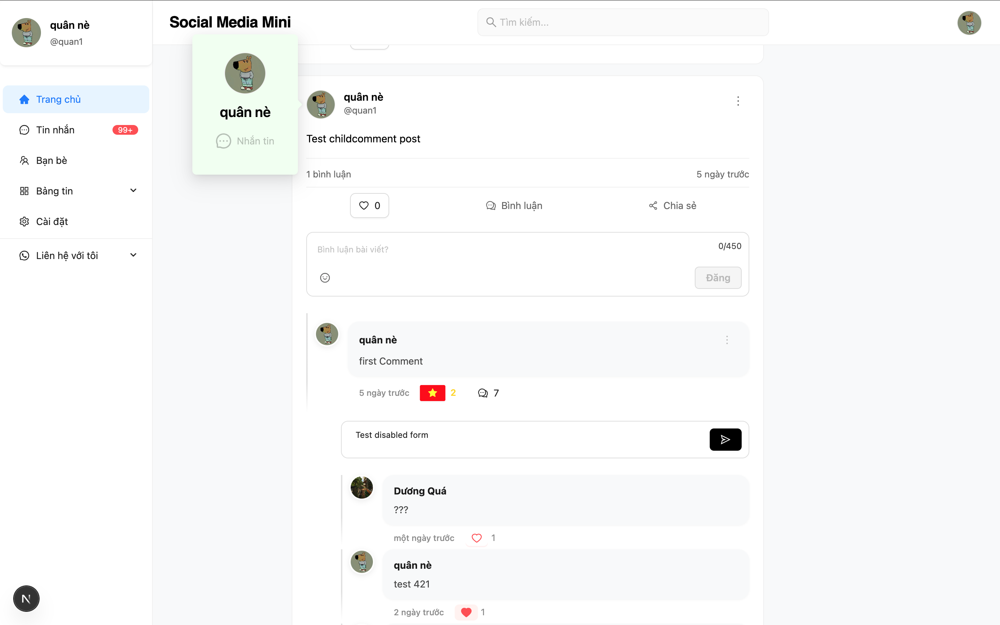

# Mini Social Network

A fullstack mini social network project built with **Next.js**, **NestJS**, **PostgreSQL**, and **Socket.io**. Features include post infinite scroll, likes, comments, real-time chat, and an admin dashboard.

## Demo



## Frontend
- Next.js, ReactJS, TypeScript
- Ant Design, Axios, Auth.js
- Socket.io-client

## Backend
- NestJS, TypeORM
- PostgreSQL
- JWT + Passport Authentication
- Multer (image upload), Throttler (rate limiting)
- Socket.io

---

# Installation & Setup

1. Clone the Repository

```bash
git clone https://github.com/minhquan2703/mini_socialmedia.git
cd mini_socialmedia

2. Install Dependencies, Create file storing environment variables (file .env) and run project
cd backend-nestjs
npm install
Generate UUID for JWT_SECRET at: https://www.uuidgenerator.net/
Create your app password at: https://support.google.com/accounts/answer/185833?hl=en
- Create file .env:
PORT=8081
DB_USERNAME="..."
DB_PASSWORD="..."
DB_DATABASE="..."
DB_PORT=5432
BACKEND_URL=http://localhost:8081
FRONTEND_URL=http://localhost:3000
JWT_SECRET=your_jwt_secret
JWT_ACCESS_TOKEN_EXPIRED=365d
MAIL_USER="your_google_mail"
MAIL_PASSWORD=your_google_app_password

npm run dev

-> Frontend
cd frontend-nextjs
npm install
- Create file .env.local:
AUTH_SECRET=your_auth_secret
NEXT_PUBLIC_BACKEND_URL=http://localhost:8081

3. Run http://localhost:3000/ in your browser (Google Chrome is recommended)


